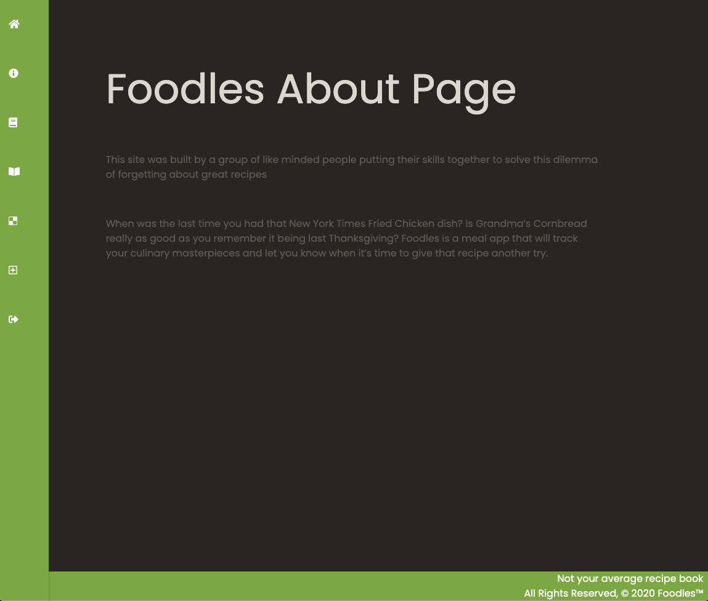
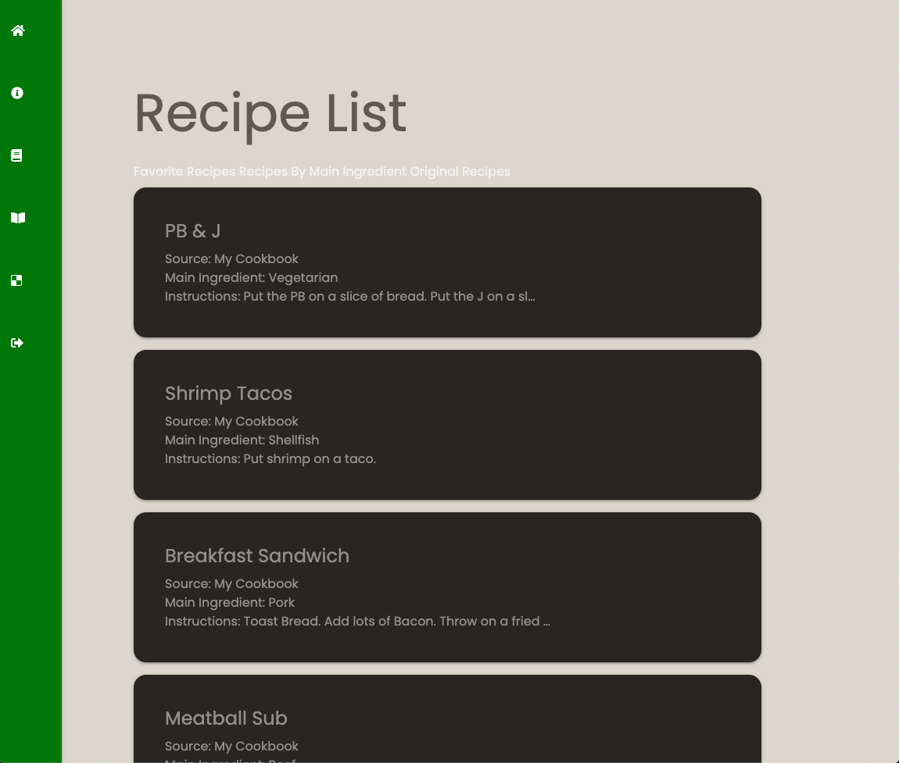
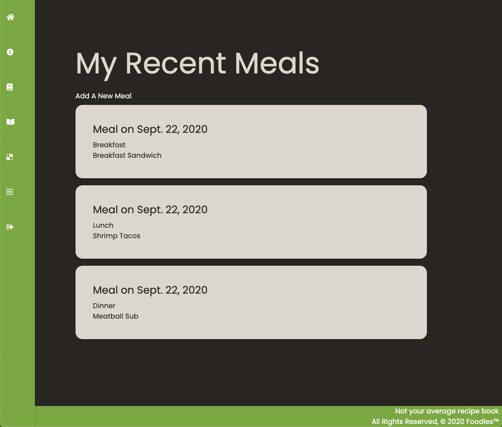

# Foodles

Foodles is a recipe app that allows you to document your culinary creations and reminds you when it time to try them again.

# Screenshots:

# Technologies Used:

* HTML
* CSS
* Python
* Django
* PostgresSQL
* Materialize

# Getting Started:

link to site

# Next Steps:

* Add photos of dishes
* View recipes by main ingredient
* View recipes by cuisine type
